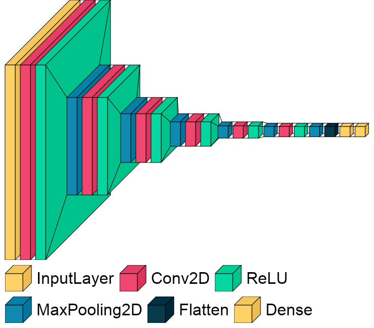

# Fall Detection with CNN Architecture

According to the World Health Organization (WHO), each year 646 000 fatal fall occurs around the world and most of the people who are injured are over 65 ([WHO, 2018](https://www.who.int/news-room/fact-sheets/detail/falls)). Therefore it is vital to detect falling immediately so that they can recieve first aid and be taken to the hospital, otherwise it can be deadly, especially for senior citizens. There are different methods to identify whether a person is falling. For example devices that are wearable on wrist or waist that use accelerometer to detect falling. In this project, I will use Convolutional Neural Network architecture to detect whether a person has fallen/falling or standing. For this purpose, I am using [this data](http://fenix.univ.rzeszow.pl/~mkepski/ds/uf.html), which is publicly available. Videos can be downloaded as images, each corresponding to one frame. Images have been labelled manually based on where falling starts. All the images have been resized by 96x96.

## CNN Architecture

We have 6 blocks for feature extraction followed by a header. Each block contains Conv2D Layer with ReLU activation and MaxPooling2D. We start with 16 units and increase by 2 after 2 block: 

 16 -> 16 -> 32 -> 32 -> 64 -> 64 

After feature extraction, we flatten the result, Dense layer with 32 units and use sigmoid activation for classification.

## CNN Architecture Visualization

## Motivation for This Project
[This paper](https://ejmcm.com/article_5270_c142136d00a954b48008a9226edd5a07.pdf) helped me a lot to work on this project, you can read it for further knowledge.
